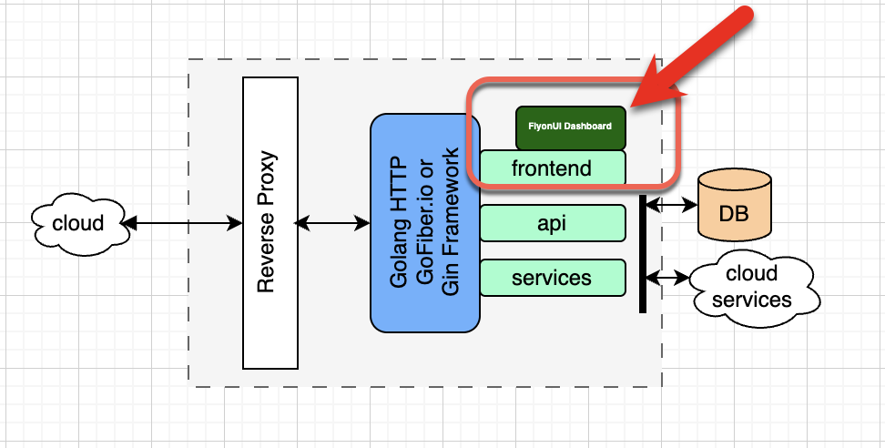
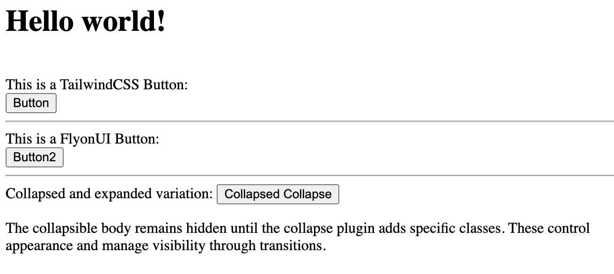
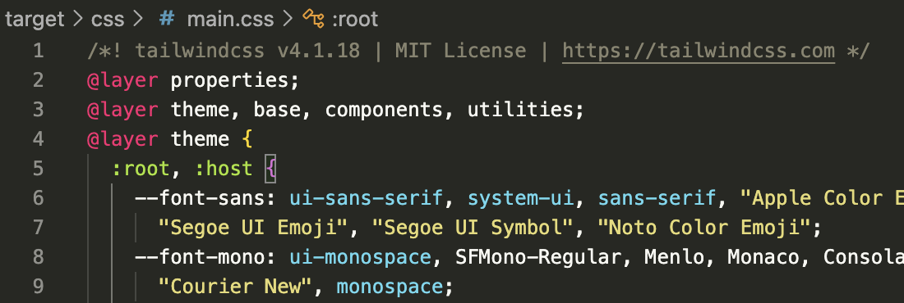

# TailwindCSS, FlyonUI integration for design delivered by Python or Golang backend

<a href="[https://](https://github.com/vguhesan/tailwindcss-flyonui-artifacts-extractor)" target="_blank">tailwindcss-flyonui-artifacts-extractor</a>

This project was created using `bun init` in bun v1.3.5. [Bun](https://bun.com) is a fast all-in-one JavaScript runtime.

## tldr;

This project allows you to extract the stylesheets and JavaScript artifacts needed to power your own Golang or Python based backend server delivering your frontend dashboard as either a static or dynamic website. 

You cab grab the latest Flyonui, v2.4.1 artifacts here: [./dist/FlyonUI-bundle.zip](./dist/FlyonUI-bundle.zip) 

But if you want to build your own using the latest TailwindCSS and FlyonUI, then follow the step by step below to generate your own custom artifacts under the [Summary](#summary) section below.

But on the other hand, if you want to fully understand how the generator works then read the full step-by-step instructions below.

## Why?

If you are a frontend developer using either a Python Flask/Django  or a Golang http/Fiber/Gin (or other similar Golang frameworks), and do not see a need for a frontend server delivered via a Node (TypeScript or JavaScript) framework but like the UI framework and design offered by TailwindCSS and FlyonUI then you need a way to extract out the generated styles and dependent scripts for using in your backend framework that pushes the content for your frontend website.

Below is a typical deployment pattern where this would be useful:



## Base setup

Pre-requisites:
1. Install Bun
2. Install npm
3. Install caddy for our webserver (only used for verification).

During my setup, here are the versions that I had on my system:
```shell
bun --version
1.3.5
npm --version
11.6.2
node --version
v24.12.0
```

1. Create a bun &lt;blank&gt; project.

```shell
bun init tailwindcss-flyonui-artifacts-extractor
```

Expected Output:

```shell
✓ Select a project template: Blank

+ .gitignore
+ CLAUDE.md
+ index.ts
+ tsconfig.json (for editor autocomplete)
+ README.md

To get started, run:

    bun run index.ts

bun install v1.3.5 (1e86cebd)

+ @types/bun@1.3.5
+ typescript@5.9.3

5 packages installed [405.00ms]
```

This creates a starter bun project using the blank template. We will now move onto setting up the base configuration elements.

2. Let's modify the created artifacts to a simple html construct.
   
```shell
# Remove line '"type": "module",' (one-liner) from package.json
cat <<EOF > ./package.json
{
  "name": "hello-world",
  "module": "index.ts",                                                                                               "private": true,
  "devDependencies": {
    "@types/bun": "latest"
  },
  "peerDependencies": {
    "typescript": "^5"
  }
}
EOF

# Remove index.ts
rm ./index.ts

# Remove tsconfig.json - since we do not plan to use any TypeScript aspects for this
rm ./tsconfig.json

# Let's create the source and target folders
mkdir -p ./src/css
mkdir -p ./target/{css,js}
mkdir -p ./dist/{css,js}

# Create a new index.html with a simple HTML template with our TailwindCSS and FlyonUI Test HTML artifacts.
# This will help us determine if everything is working as expected in the generated stylesheets
cat <<EOF > ./index.html
<html lang="en">
<head>
    <meta charset="UTF-8" />
    <meta name="viewport" content="width=device-width, initial-scale=1.0" />
    <title>Extraction of FlyonUI style sheets</title>
    <style>
        body {
            margin: 20px; /* Adds 20px margin to all sides */
        }
    </style>
</head>
<body>
    <h1 class="text-2xl font-bold underline text-red-600 dark:text-red-400">
    Hello world!
    </h1>
    <br/>

    This is a TailwindCSS Button:<br/>
    <button class="bg-blue-500 hover:bg-blue-700 text-white font-bold py-2 px-4 rounded">
    Button
    </button>
    <hr/>
    This is a FlyonUI Button:<br/>
    <button class="btn btn-primary rounded-full">Button2</button>
    <hr/>
    Collapsed and expanded variation:
    <button type="button" class="collapse-toggle btn btn-primary" id="basic-collapse" aria-expanded="false" aria-controls="basic-collapse-heading" data-collapse="#basic-collapse-heading" >
    <span class="collapse-open:hidden">Collapsed</span>
    <span class="collapse-open:block hidden">Collapse</span>
    <span class="icon-[tabler--chevron-down] collapse-open:rotate-180 transition-rotate size-4 duration-300"></span>
    </button>
    <div id="basic-collapse-heading" class="collapse hidden w-full overflow-hidden transition-[height] duration-300" aria-labelledby="basic-collapse" >
    <div class="border-base-content/25 mt-3 rounded-md border p-3">
        <p class="text-base-content/80">
        The collapsible body remains hidden until the collapse plugin adds specific classes. These control appearance and
        manage visibility through transitions.
        </p>
    </div>
    </div>
</body>
</html>
EOF
```

3. Let's render the test HTML in a browser.

    Please note that when you render all the elements will not work as anticipated. We are first creating a 'fail-all' test and we will slowly introduce Tailwindcss first and then FlyonUI themes.

    Let us create a Caddy webserver static file server.

    Add a `caddyfile` with the following content:

```shell:caddyfile
cat <<EOF > ./caddyfile
localhost
file_server
EOF
```

Let's fire up the Caddy webserver:

```shell
caddy run --watch
```

In a browser open and visit: `https://localhost/`.



## Adding the styles

4. Install preprocessor packages:

```shell
# npm install -D tailwindcss @tailwindcss/postcss flyonui @iconify/tailwind4 @iconify/json postcss postcss-cli autoprefixer postcss-import 
bun   install -D tailwindcss @tailwindcss/postcss flyonui @iconify/tailwind4 @iconify/json postcss postcss-cli autoprefixer postcss-import 
```

5. We will use Postcss and some of the Postcss plugins to do the preprocessor magic.

Create a `postcss.config.js` and add the following contents:

```shell:postcss.config.js
cat <<EOF > ./postcss.config.js
module.exports = {
  plugins: [
    require('postcss-import'),
    require('autoprefixer')({
      overrideBrowserslist: ['> 0.5% in US', 'Safari > 9'] // Example browser list
    }),
    require('@tailwindcss/postcss')({}),
    // Add other plugins here (e.g., require('cssnano') for minification)
  ]
};
EOF
```

This configures the postcss with the three plugins (import, autoprefixer, tailwindcss/postcss)

Let's begin generating the stylesheets.

## Generating the TailwindCSS style sheets.

Create a `\src\css\main.css` with the needed '@import' for TailwindCSS.

```shell
cat <<EOF > ./src/main.css
@import "tailwindcss";
EOF
```

This will bring down the needed Tailwindcss pieces and place them into the `main.css` when you run Postcss (after you run the Postcss preprocessor step).

Let's generate the Tailwindcss stylesheet.

```shell
# npx postcss src/css/main.css --output target/css/tailwind-only.css
bunx  postcss src/css/main.css --output target/css/tailwind-only.css
```

You should now have the base Tailwindcss stylesheet under `./dist/css/`. Below is a sample screenshot of how the file contents may look like. (Your output may vary)



As of writing this article, Tailwindcss does not have any JavaScript scripts that are utilized for any front-end. Therefore no JS is generated.

Onto generating the FlyonUI parts.

### Let's verify what we get.

Let's add the newly generated stylesheet to the `index.html` file. 

In this step, we are simply adding in one stylesheet reference to the HTML:

`<link href="/target/css/tailwind-only.css" rel="stylesheet">`

```shell
cat <<EOF > ./index.html
<html lang="en">
<head>
    <meta charset="UTF-8" />
    <meta name="viewport" content="width=device-width, initial-scale=1.0" />
    <title>Extraction of FlyonUI style sheets</title>
    <link href="/target/css/tailwind-only.css" rel="stylesheet">
    <style>
        body {
            margin: 20px; /* Adds 20px margin to all sides */
        }
    </style>
</head>
<body>
    <h1 class="text-2xl font-bold underline text-red-600 dark:text-red-400">
    Hello world!
    </h1>
    <br/>

    This is a TailwindCSS Button:<br/>
    <button class="bg-blue-500 hover:bg-blue-700 text-white font-bold py-2 px-4 rounded">
    Button
    </button>
    <hr/>
    This is a FlyonUI Button:<br/>
    <button class="btn btn-primary rounded-full">Button2</button>
    <hr/>
    Collapsed and expanded variation:
    <button type="button" class="collapse-toggle btn btn-primary" id="basic-collapse" aria-expanded="false" aria-controls="basic-collapse-heading" data-collapse="#basic-collapse-heading" >
    <span class="collapse-open:hidden">Collapsed</span>
    <span class="collapse-open:block hidden">Collapse</span>
    <span class="icon-[tabler--chevron-down] collapse-open:rotate-180 transition-rotate size-4 duration-300"></span>
    </button>
    <div id="basic-collapse-heading" class="collapse hidden w-full overflow-hidden transition-[height] duration-300" aria-labelledby="basic-collapse" >
    <div class="border-base-content/25 mt-3 rounded-md border p-3">
        <p class="text-base-content/80">
        The collapsible body remains hidden until the collapse plugin adds specific classes. These control appearance and
        manage visibility through transitions.
        </p>
    </div>
    </div>
</body>
</html>
EOF
```
Now if you reload the site in your browser, you should see the change with TailwindCSS now rendering correctly (as shown below)


## Generating the FlyonUI stylesheet and JavaScript

As of writing this article, FlyonUI combines three other frameworks:

From the <a href="https://flyonui.com/docs/getting-started/quick-start/?theme=light" target="_blank">FlyonUI website</a>:

<blockquote>
<p>FlyonUI brings together the beauty of semantic classes and the interactive headless JavaScript plugins, offering you a powerful toolkit to build stunning, interactive user interfaces with ease.</p>

<p>
Under the hood, it uses the strengths of:
<ul>
    <li>
        <a href="[https://](https://tailwindcss.com/)" target="_blank">Tailwind CSS</a>: A utility-first CSS framework that helps you build beautiful websites with ease. (Generates CSS only).
    </li>
    <li>
        <a href="[https://](https://daisyui.com/)" target="_blank">daisyUI</a> adds component semantic class names to Tailwind CSS so you can make beautiful websites faster, easier and Maintainable. (Generates CSS only).
    </li>
    <li>
        <a href="https://" target="_blank">Preline</a> JavaScript headless & fully unstyled Tailwind plugins for accessible, responsive UI. Enhance experiences with animations, transitions, and more. (Generates CSS plus JavaScript).
    </li>
</ul>
</p>
</blockquote>

Let's modify the `/src/css/main.css` to now include the needed other framework preprocessor artifacts:

```shell
cat <<EOF > ./src/css/main.css
@import "tailwindcss";
@import "../../node_modules/flyonui/variants.css";

@plugin "flyonui";
@plugin "@iconify/tailwind4";

@source "../../node_modules/flyonui/dist/index.js";
EOF
```

Please note that the above segment adds also the FlyonUI "variant.css" and it's supporting JavaScript files "index.js".

Let's generate the Tailwind plus FlyonUI artifacts:

```shell
# npx postcss src/css/main.css --output target/css/tailwind-plus-flyonui.css
bunx  postcss src/css/main.css --output target/css/tailwind-plus-flyonui.css
```
### Let's verify what we get.

Let's add the newly generated stylesheet to the `index.html` file along with the dependent `flyonui.js` 

In this step, we are simply adding in one stylesheet reference to the HTML:

`<link href="/target/css/tailwind-plus-flyonui.css" rel="stylesheet">` and `<script src="/target/js/flyonui.js"></script>`

```shell
# Copy `flyonui.js` from node_modules source folder
cp ./node_modules/flyonui/flyonui.js ./target/js/flyonui.js
```

```shell
cat <<EOF > ./index.html
<html lang="en">
<head>
    <meta charset="UTF-8" />
    <meta name="viewport" content="width=device-width, initial-scale=1.0" />
    <title>Extraction of FlyonUI style sheets</title>
    <link href="/target/css/tailwind-plus-flyonui.css" rel="stylesheet">
    <script src="/target/js/flyonui.js"></script>
    <style>
        body {
            margin: 20px; /* Adds 20px margin to all sides */
        }
    </style>
</head>
<body>
    <h1 class="text-2xl font-bold underline text-red-600 dark:text-red-400">
    Hello world!
    </h1>
    <br/>

    This is a TailwindCSS Button:<br/>
    <button class="bg-blue-500 hover:bg-blue-700 text-white font-bold py-2 px-4 rounded">
    Button
    </button>
    <hr/>
    This is a FlyonUI Button:<br/>
    <button class="btn btn-primary rounded-full">Button2</button>
    <hr/>
    Collapsed and expanded variation:
    <button type="button" class="collapse-toggle btn btn-primary" id="basic-collapse" aria-expanded="false" aria-controls="basic-collapse-heading" data-collapse="#basic-collapse-heading" >
    <span class="collapse-open:hidden">Collapsed</span>
    <span class="collapse-open:block hidden">Collapse</span>
    <span class="icon-[tabler--chevron-down] collapse-open:rotate-180 transition-rotate size-4 duration-300"></span>
    </button>
    <div id="basic-collapse-heading" class="collapse hidden w-full overflow-hidden transition-[height] duration-300" aria-labelledby="basic-collapse" >
    <div class="border-base-content/25 mt-3 rounded-md border p-3">
        <p class="text-base-content/80">
        The collapsible body remains hidden until the collapse plugin adds specific classes. These control appearance and
        manage visibility through transitions.
        </p>
    </div>
    </div>
</body>
</html>
EOF
```
Now if you reload the site in your browser, you should see the change with TailwindCSS now rendering correctly (as shown below)


# Summary

In this article, we started with a plain static HTML and we first integrated Tailwindcss. We then integrated Tailwindcss plus FlyonUI artifacts.

At this point, you can simply copy the pieces you need into your Golang or Python back-end where it serves the artifacts as part of your front-end dashboard development.

As of this article, here are the versions of each of the generated artifacts that are used:

- Tailwindcss, v4.1.18
- Flyonui, v2.4.1
- Iconify, v1.2.0

If you would like to rebulil them with the latest versions of those artifact, you simply need to run the following steps:

```shell
# npm install
bun install
```
Then rebuild the FlyonUI artifacts:

```shell
# npx postcss src/css/main.css --output target/css/tailwind-plus-flyonui.css
bunx  postcss src/css/main.css --output target/css/tailwind-plus-flyonui.css

# Grab the latest FlyonUI JavaScript file.
# Copy `flyonui.js` from node_modules source folder
cp ./node_modules/flyonui/flyonui.js ./target/js/flyonui.js
```

That's it! 

I hope this article has been useful for you. If you like this article, please consider subscribing and re-share this article in your favorite social post. 

Thanks for checking out.

